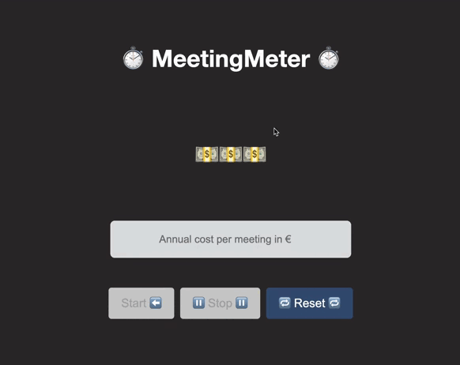

#   SwiftWASMWorkshop

👋 Welcome to the Swift WebAssembly workshop for Software Engineers 👋



If you just get to this repository is because you are interested in learning about Swift and WebAssemlby 🥳! If this is the case, please, checkout to the branch named ``practice`` and continue reading 💪

```git checkout practice```

This repository contains a list of exercises designed as an introduction to Swift and WebAssembly you can follow step by step. The topics you'll cover during this workshop are:

* What's Web Assembly.
* How can I use Web Assembly and Swift as a Software Engineer.
* How can we use carton as our bundler and main tool.
* What are the implications on the project architecture.
* How can I create a web application using WebAssembly and Swift.
* How to interop with JavaScript and the Browser from Swift.
* Tooling available and development alternatives for professional environments.

## Useful commands

Open your terminal and get ready to code 💻

```
swift run carton dev # Runs the app and starts hot reloading for localhost:8080
swift run carton test #Runs XCTest suite in the full JavaScript/DOM environment
swift run carton bundle #Optimizing and packaging the app for distribution with
swift test # Executes all the package tests
```

## Credits

🙏 Special mention and thanks to all the [Swift WASM team](https://github.com/swiftwasm) and [Yuta Saito](https://github.com/kateinoigakukun) for making this workshop possible after years of hard work and collaboration 🙏

Developed By
------------

* Pedro Vicente Gómez Sánchez - <pedrovicente.gomez@gmail.com>

<a href="https://twitter.com/pedro_g_s">
  
</a>
<a href="https://es.linkedin.com/in/pedrovgs">
  
</a>

License
-------

Copyright 2025 Pedro Vicente Gómez Sánchez

        Apache License
    Version 2.0, January 2004
http://www.apache.org/licenses/
